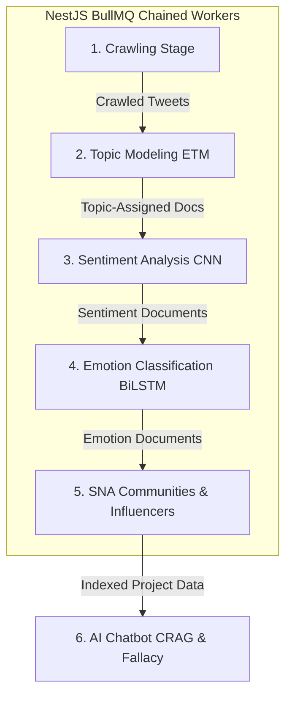
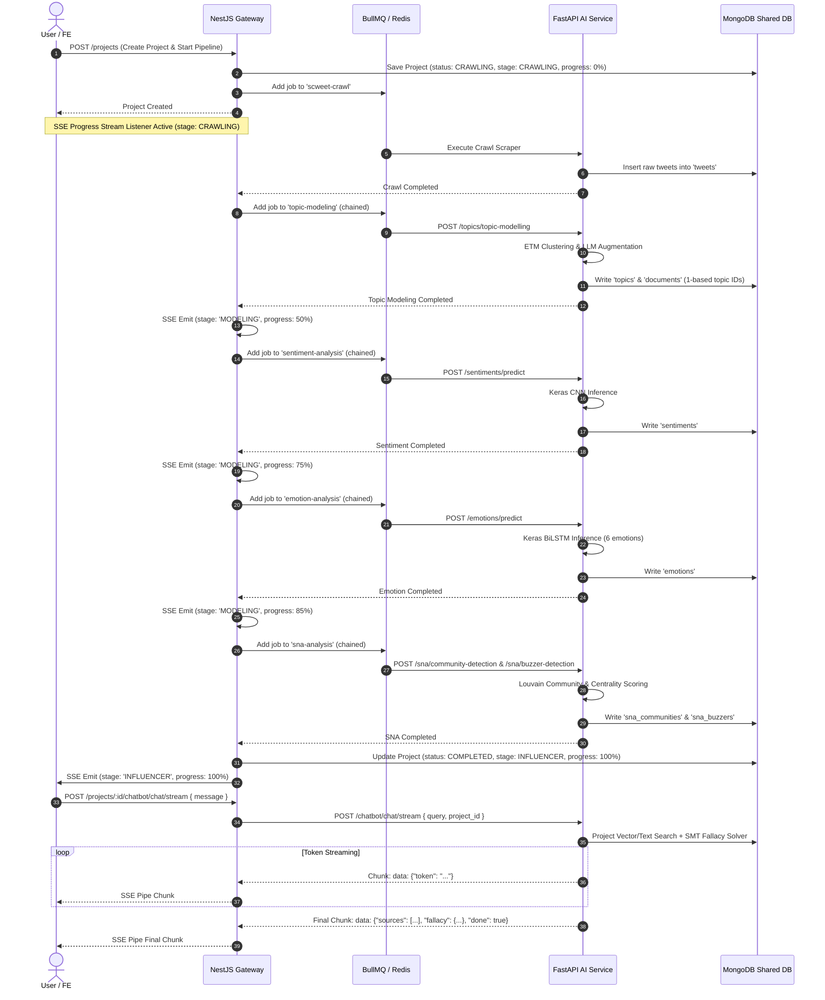

# SociaLabs Platform - Application Overview & Architecture

## 1. High-Level Overview

SociaLabs is an end-to-end Indonesian social media intelligence and analytics platform. The application captures raw social conversations (X/Twitter), processes them through dynamic NLP and deep learning pipelines, detects community structures and key influencers, and enables interactive AI-driven exploration through Corrective RAG (CRAG) and Logical Fallacy Detection.

```
┌────────────────────────────────────────────────────────────────────────┐
│                          React 19 Frontend                             │
│                  (Vite, TypeScript, TailwindCSS 4)                     │
└───────────────────────────────────┬────────────────────────────────────┘
                                    │ REST API / SSE Streams
                                    ▼
┌────────────────────────────────────────────────────────────────────────┐
│                        NestJS API Gateway                              │
│       - Auth, Workspaces, Projects & Tweet Management                  │
│       - BullMQ Chained Job Queues (Crawling -> Modeling -> SNA)        │
│       - Progress EventSource SSE Stream                                │
└─────────────────┬──────────────────────────────────┬───────────────────┘
                  │ PyMongo / Beanie                 │ HTTP Proxy / SSE
                  ▼                                  ▼
┌──────────────────────────────────┐   ┌─────────────────────────────────┐
│     Shared MongoDB Database      │   │    FastAPI AI Service           │
│  - NestJS: users, projects,      │   │  - Topic Modeling (ETM)         │
│            workspaces, tweets    │   │  - Sentiment (CNN / CNN-LSTM)   │
│  - AI: topics, sentiments,       │   │  - Emotion (CNN / BiLSTM)       │
│        emotions, sna, chatbot    │   │  - SNA (Louvain & Centrality)   │
└──────────────────────────────────┘   │  - Chatbot (CRAG, Fallacy, SSE) │
                                       └─────────────────────────────────┘
```

## 2. End-to-End Pipeline Architecture

The platform operates a 6-stage chained analytics pipeline:



### Stage Summary

1. **Crawling (`CRAWLING`)**: Scweet scraper extracts tweets by keyword & date range into `tweets` collection.
2. **Topic Modeling (`MODELING`)**: ETM algorithm clusters tweets into 1-based topic IDs with AI context generation.
3. **Sentiment Analysis**: CNN / CNN-LSTM classifies text into Positive/Negative sentiments and generates word frequencies.
4. **Emotion Classification**: CNN / BiLSTM categorizes text into 6 emotions (`Anger`, `Fear`, `Joy`, `Love`, `Sad`, `Neutral`).
5. **Social Network Analysis (`INFLUENCER`)**: Louvain detects network communities; Betweenness/Eigenvector centrality ranks influencers.
6. **AI Chatbot**: Project-scoped Corrective RAG + SMT Fallacy Solver streams real-time token answers.

## 3. End-to-End System Sequence Diagram



## 4. Communication & Real-time Protocols

| Protocol                 | Usage                                              | Implementation                                                           |
| ------------------------ | -------------------------------------------------- | ------------------------------------------------------------------------ |
| **REST API**             | Auth, CRUD operations, static analytics fetches    | Axios client in FE, Express controllers in NestJS                        |
| **BullMQ + Redis**       | Background job queueing & chained execution        | `@nestjs/bullmq` workers in NestJS                                       |
| **SSE (Progress)**       | Global project stage & percentage progress updates | `@Sse()` RxJS Observable endpoint in NestJS, EventSource in FE           |
| **SSE (Chat Streaming)** | Token-by-token real-time LLM typing response       | Express `res.write` stream pipe in NestJS, `ReadableStream` reader in FE |

## 5. Shared MongoDB Strategy

Both backends share the database (`socialabs_db`):

- **NestJS Primary Collections**: `users`, `workspaces`, `projects`, `tweets` (owned by NestJS Mongoose DTOs).
- **FastAPI AI Primary Collections**: `topics`, `documents`, `sentiments`, `emotions`, `sna_communities`, `sna_buzzers`, `conversations`, `messages`, `fallacy_detections` (owned by FastAPI Beanie ODM).
- **External Collection Access**: FastAPI reads NestJS `tweets` collection using native PyMongo `AsyncDatabase` queries.
