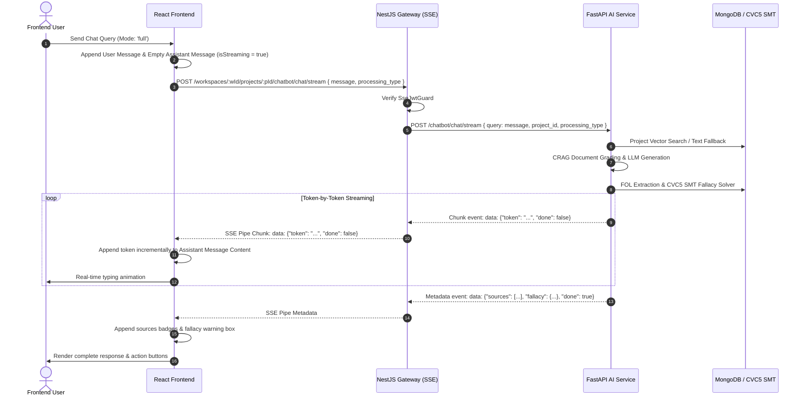

# Technical Documentation: AI Chatbot (CRAG + Fallacy + SSE Streaming)

## 1. Feature Overview
The Chatbot module provides conversational AI tailored strictly to the active project's dataset using Corrective RAG (CRAG) and Logical Fallacy Detection (FOL extraction + SMT solver). It streams assistant responses token-by-token in real-time via Server-Sent Events (SSE).

## 2. Architecture Components
- **Frontend (`socialabs-fe`)**:
  - `useProjectChatbot`: Custom hook managing active message streams with `fetch` and `ReadableStream` reader.
  - UI Components: Mode selector dropdown (`Full Pipeline`, `CRAG RAG Only`, `Fallacy Detection Only`, `Simple Chat`), real-time typing indicator, sources badges, fallacy warning boxes, and `SidebarChatbot` session history.
- **NestJS Gateway (`socialabs-be-nest`)**:
  - `ProjectController.streamChat`: Express SSE streaming controller endpoint (`POST /:projectId/chatbot/chat/stream`).
  - `SseJwtGuard`: Verifies JWT tokens from query parameters or `Authorization` headers.
- **FastAPI AI Service (`socialabs-be-ai`)**:
  - `CRAGService`: Vector search (MongoDB Atlas or project text search fallback), document grading, web search context fallback, and LLM answer generation.
  - `FallacyService`: First-Order Logic extraction, semantic intent analysis, CVC5 SMT solving, and modification suggestions.
  - `POST /chatbot/chat/stream`: LangChain token streaming endpoint.

## 3. Data Flow Diagram (Mermaid)



## 4. Data Contracts & Interfaces

### Chat Payload & Types
```ts
export type ChatProcessingType = 'full' | 'crag' | 'fallacy' | 'simple';

export interface ChatMessageSource {
  title: string;
  url?: string;
}

export interface FallacyAnalysisResult {
  fallacyType: string | null;
  confidence: number;
  explanation?: string;
  suggestedModification?: string;
}

export interface ChatMessageItem {
  id: string;
  role: 'user' | 'assistant';
  content: string;
  processingType?: ChatProcessingType;
  sources?: ChatMessageSource[];
  fallacy?: FallacyAnalysisResult;
  createdAt: string;
}

export interface ConversationSession {
  id: string;
  projectId: string;
  title: string;
  createdAt: string;
}
```

## 5. Maintenance & Notes for Developers
- **Query Parameter Mapping**: FastAPI expects `query` field. NestJS gateway maps `query: body.query ?? body.message` to prevent HTTP 422 errors.
- **MongoDB Search Fallback**: If MongoDB instance is local Community Server without Atlas Search (`$vectorSearch`), `VectorRepository` automatically falls back to project-scoped regex matching.
