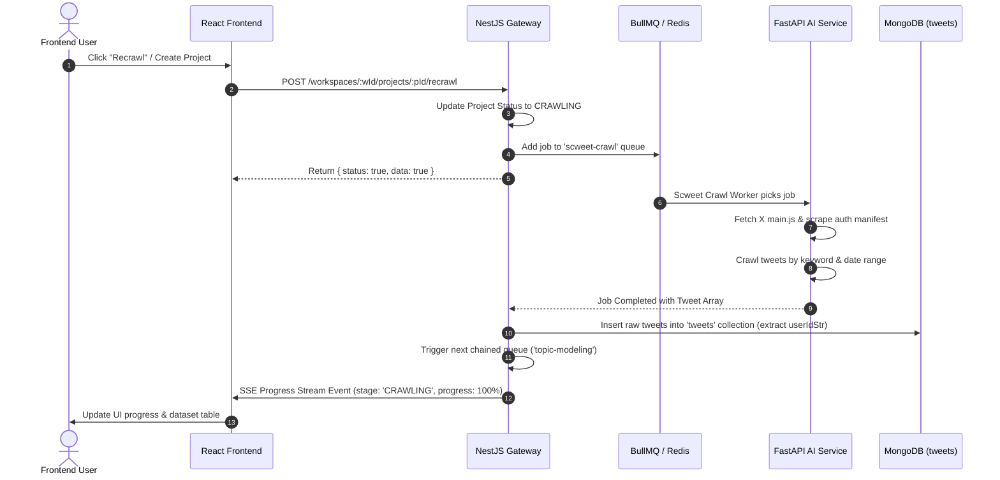

# Technical Documentation: Twitter/X Crawling Pipeline

## 1. Feature Overview
The Crawling module fetches tweets from Twitter/X based on project keywords and date ranges using Scweet (curl-cffi & Playwright headless browser). The process is handled asynchronously via BullMQ queues and NestJS gateway, and results are stored in MongoDB shared database.

## 2. Architecture Components
- **Frontend (`socialabs-fe`)**: Initiates crawl via `projectApi.recrawlProject()`, listens to SSE stream progress events via `useProjectProgress()`.
- **NestJS Gateway (`socialabs-be-nest`)**:
  - `CrawlQueue` & `CrawlProcessor`: Handles queued crawling background jobs.
  - `TweetModel` (Mongoose): Stores raw tweets into shared `tweets` collection.
  - `ProjectProgressGateway`: Emits progress SSE events to FE.
- **FastAPI AI Service (`socialabs-be-ai`)**:
  - `Scweet` / `processor.py`: Executes authenticated manifest scraping and tweet extraction from X.

## 3. Data Flow Diagram (Mermaid)



## 4. Data Contracts & Interfaces

### NestJS Tweet Schema
```ts
export interface Tweet {
  id: string;
  projectId: string;
  tweetId: string;
  fullText: string;
  createdAtTwitter: Date;
  userIdStr: string; // Extracted screen_name or user_id
  tweetUrl: string;
  quoteCount: number;
  replyCount: number;
  retweetCount: number;
  favoriteCount: number;
}
```

## 5. Troubleshooting & Notes for Developers
- **Scweet Manifest Errors**: Scweet relies on dynamic regex parsing of `x.com/main.js`. Ensure valid `SCWEET_AUTH_TOKEN` is configured in `socialabs-be-ai/.env`.
- **Username Extraction**: NestJS `CrawlProcessor` parses `screen_name` directly from `tweetUrl` regex `/(?:x\.com|twitter\.com)\/([^/]+)\/status/i` if `user_id_str` is unavailable.
