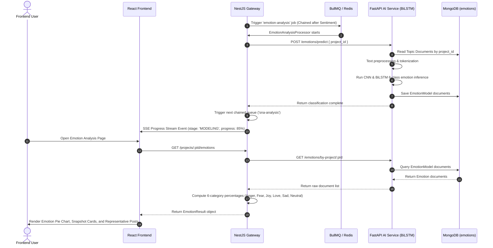

# Technical Documentation: Emotion Classification Pipeline

## 1. Feature Overview
The Emotion Classification module categorizes project documents into 6 core Indonesian emotional states (`Anger`, `Fear`, `Joy`, `Love`, `Sad`, `Neutral`) using CNN and BiLSTM neural networks.

## 2. Architecture Components
- **Frontend (`socialabs-fe`)**: Renders emotion distribution pie chart, dominant emotion metric cards, 6-category percentage breakdown bars, and representative posts per emotion.
- **NestJS Gateway (`socialabs-be-nest`)**:
  - `EmotionAnalysisProcessor` (BullMQ): Handles emotion classification jobs.
  - `AiBackendClient.getEmotions()`: Normalizes raw document responses from AI Backend into 6-category percentage metrics (`emotionPercentageCnn` and `emotionPercentageBilstm`).
- **FastAPI AI Service (`socialabs-be-ai`)**:
  - CNN & BiLSTM Keras model engine (`app/domains/emotion/`).

## 3. Data Flow Diagram (Mermaid)



## 4. Data Contracts & Interfaces

```ts
export interface EmotionPercentage {
  Anger: number;
  Fear: number;
  Joy: number;
  Love: number;
  Sad: number;
  Neutral: number;
}

export interface EmotionResult {
  total: number;
  documents: EmotionDocument[];
  emotionPercentageCnn: EmotionPercentage;
  emotionPercentageBilstm: EmotionPercentage;
  emotionByTopicCnn: Record<string, EmotionPercentage>;
  emotionByTopicBilstm: Record<string, EmotionPercentage>;
}
```

## 5. Maintenance & Notes for Developers
- **6 Core Emotion Labels**: Must remain exact case: `Anger`, `Fear`, `Joy`, `Love`, `Sad`, `Neutral`.
- **Normalization Gate**: `AiBackendClient.getEmotions` in NestJS validates that `emotionPercentageCnn` is never undefined even when AI Backend returns raw uncalculated document arrays.
