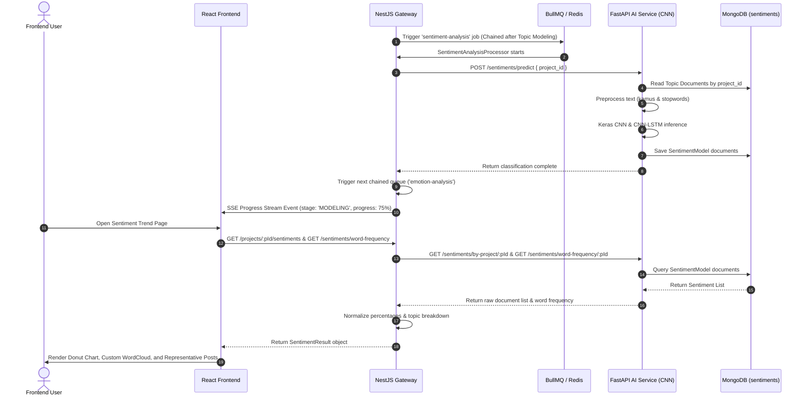

# Technical Documentation: Sentiment Analysis Pipeline

## 1. Feature Overview
The Sentiment Analysis module classifies project documents into Positive (`Positif`) and Negative (`Negatif`) sentiment using Convolutional Neural Networks (CNN) and CNN-LSTM models trained on Indonesian text. It also computes word frequency for interactive word cloud visualization.

## 2. Architecture Components
- **Frontend (`socialabs-fe`)**: Displays sentiment distribution pie charts, positive & negative sentiment metrics, SVG Word Cloud, and representative posts.
- **NestJS Gateway (`socialabs-be-nest`)**:
  - `SentimentAnalysisProcessor` (BullMQ): Handles sentiment analysis jobs.
  - `AiBackendClient.getSentiments()`: Normalizes raw document lists from AI Backend into total counts, percentages, and topic breakdowns.
- **FastAPI AI Service (`socialabs-be-ai`)**:
  - Keras CNN / CNN-LSTM model inference engine.
  - Word frequency endpoint (`GET /sentiments/word-frequency/:project_id`).

## 3. Data Flow Diagram (Mermaid)



## 4. Data Contracts & Interfaces

```ts
export interface SentimentPercentage {
  positive: number;
  negative: number;
}

export interface SentimentResult {
  total: number;
  documents: SentimentDocument[];
  sentimentPercentageCnn: SentimentPercentage;
  sentimentPercentageCnnLstm: SentimentPercentage;
  sentimentByTopicCnn: Record<string, SentimentPercentage & { total: number }>;
}

export interface WordFrequency {
  positive: { word: string; count: number }[];
  negative: { word: string; count: number }[];
}
```

## 5. Maintenance & Notes for Developers
- **Label Mapping**: Backend uses `Positif` / `Negatif`. Frontend `mapSentimentLabel` maps these to `Positive` / `Negative`.
- **Word Cloud Rendering**: Uses `@isoterik/react-word-cloud` `useWordCloud` hook wrapped in a custom 400x300 SVG canvas to maintain fixed layout styling.
