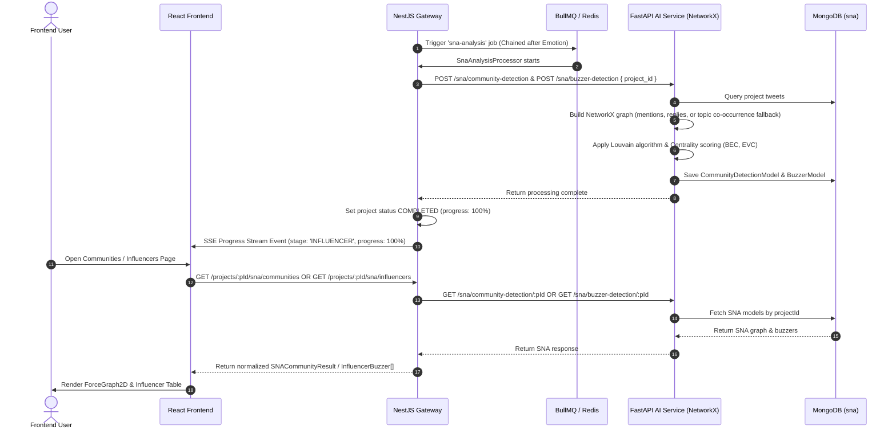

# Technical Documentation: Social Network Analysis (SNA) Pipeline

## 1. Feature Overview
The SNA module performs Louvain Community Detection to discover interaction clusters and calculates Betweenness & Eigenvector Centrality metrics to identify influential users (buzzers/influencers) and their structural roles in the network.

## 2. Architecture Components
- **Frontend (`socialabs-fe`)**:
  - **Communities Page**: Renders 2D interactive force-directed graph (`ForceGraph2D`), community cluster percentages, network leaders, and cluster conversation snapshots.
  - **Influencers Page**: Renders influencer snapshot metrics, role classification distribution cards, and ranked centrality table.
- **NestJS Gateway (`socialabs-be-nest`)**:
  - `SnaAnalysisProcessor` (BullMQ): Handles background SNA processing jobs.
  - `AiBackendClient.getCommunityDetection()` & `getBuzzerDetection()`: Normalizes node/edge IDs, community attributes, and centrality scores.
- **FastAPI AI Service (`socialabs-be-ai`)**:
  - Louvain Community Detection & NetworkX Centrality engine (`app/domains/sna/`).

## 3. Data Flow Diagram (Mermaid)



## 4. Data Contracts & Interfaces

```ts
export interface SNACommunityNode {
  id: string;
  name: string;
  community: number;
  val?: number;
  color?: string;
}

export interface SNACommunityEdge {
  source: string;
  target: string;
  weight?: number;
  sourceCommunity?: number;
  targetCommunity?: number;
  fullText?: string;
  topic?: string;
  tweetUrl?: string;
}

export interface SNACommunityResult {
  totalCommunities: number;
  totalNodes: number;
  totalEdges: number;
  nodes: SNACommunityNode[];
  edges: SNACommunityEdge[];
}

export type InfluencerRole = 'Originator' | 'Amplifier' | 'Engager' | 'Bridge';

export interface InfluencerBuzzer {
  id: string;
  username: string;
  influenceScore: number;
  role: InfluencerRole;
  betweennessCentrality: number;
  eigenvectorCentrality: number;
  finalMeasure: number;
  rank: number;
  community?: number;
}
```

## 5. Role Classification & Fallback Rules
- **Role Determination**:
  - `Bridge`: `betweennessCentrality / (eigenvectorCentrality + 1e-6) > 1.5`
  - `Amplifier`: `eigenvectorCentrality / (betweennessCentrality + 1e-6) > 1.5`
  - `Originator`: `rank <= 3`
  - `Engager`: Default fallback.
- **Edge Fallback**: If dataset tweets have 0 direct `@mentions` or replies, AI Service builds topic co-occurrence fallback edges to form valid community clusters.
