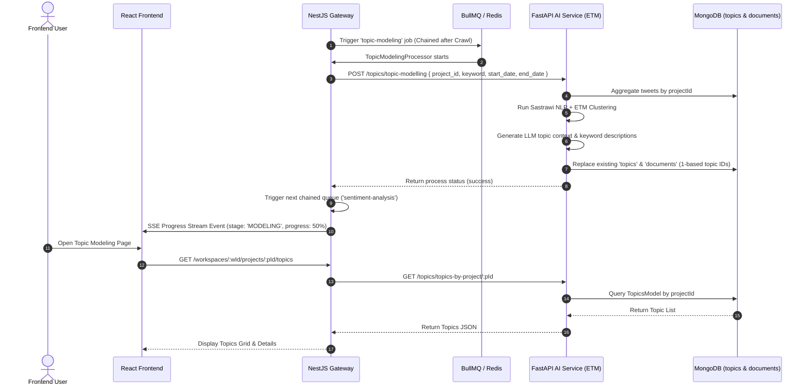

# Technical Documentation: Topic Modeling Pipeline (ETM)

## 1. Feature Overview
The Topic Modeling module uses Embedded Topic Modeling (ETM) via OCTIS & Sastrawi NLP preprocessing in FastAPI AI Service. It clusters dataset tweets into coherent topics, assigns topic IDs (1-based), and provides AI-augmented context descriptions.

## 2. Architecture Components
- **Frontend (`socialabs-fe`)**: Visualizes topic list cards, context drawer, keywords, and representative posts.
- **NestJS Gateway (`socialabs-be-nest`)**:
  - `TopicModelingProcessor` (BullMQ): Process topic modeling jobs.
  - `AiBackendClient.getTopics()` / `getDocuments()`: Proxies requests to AI service.
- **FastAPI AI Service (`socialabs-be-ai`)**:
  - ETM Engine (`app/domains/topic_modeling/`): Executes 10-step Indonesian NLP pipeline, ETM inference, and LLM data augmentation.
  - MongoDB (`topics`, `documents` collections): Managed via Beanie ODM.

## 3. Data Flow Diagram (Mermaid)



## 4. Data Contracts & Interfaces

### Topic Model Interface
```ts
export interface Topic {
  id: string;
  topicId: number; // 1-based index (Topic 1, Topic 2, etc.)
  projectId: string;
  keyword: string;
  words: string[];
  context: string; // AI generated topic explanation
}

export interface TopicDocument {
  id: string;
  projectId: string;
  fullText: string;
  rawText: string;
  username: string;
  tweetUrl: string;
  topic: number; // Matches topicId
  probability: number;
}
```

## 5. Maintenance & Notes for Developers
- **1-Based Topic Indexing**: Topics and documents use 1-based indexing (`topicId = idx + 1`).
- **Data Replacement**: Running topic modeling for a project automatically replaces previous `topics` and `documents` for that `projectId` to prevent orphan duplicate data.
